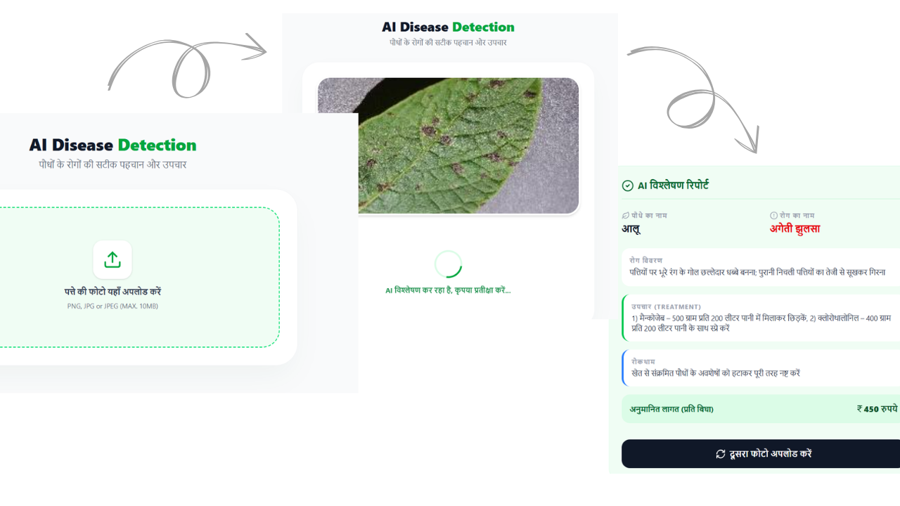

# KisanMitra AI 
### *From sowing seeds to selling crops — we walk the field with you.* 

  

---

## Brief

KisanMitra AI is an end-to-end smart agriculture solution designed to support farmers at every stage of the agricultural lifecycle.

---

## Problem Statement

Farmers face several challenges throughout the agricultural lifecycle:

- Lack of access to reliable and timely crop guidance.
- Delayed detection of plant diseases, leading to crop damage.
- Unpredictable weather conditions affecting crop planning.
- Fluctuating market prices that reduce farmers' profitability.
- Dependence on traditional knowledge or scattered information sources.
- Poor crop decisions that often result in reduced yield and financial losses.


## 🌾 Project Overview  

Kisan Mitra AI is an AI-powered agriculture platform that assists farmers with plant disease detection, crop advisory, and real-time mandi price (agricultural market price) insights to improve productivity and profitability.


---

## Key Features

* **AI-Powered Disease Detection:** Instant identification of crop diseases via image uploads with actionable recovery steps.
* **Intelligent Crop Advisory:** Personalized recommendations for crop selection and soil management based on real-time data.
* **Mandi Price (Market Rates):** Live tracking of regional and national market prices to maximize profit margins, [working].
* **Interactive Dashboard:** A simplified view of all agricultural insights, from soil health to harvest readiness.
* **Hindi Language Support:** Breaking the language barrier with a fully localized text interface.
* **Mobile-First UI:** An easy-to-use, responsive interface designed specifically for mobile users.
* **One-Tap Authentication:** Quick and secure access via **Google Login**, removing the friction of traditional sign-ups.





## 🎥 Project Demo

Click the image below to watch the full demo of **Kisan Mitra AI**.

[](https://drive.google.com/file/d/16_ujh9--TmOa6DkWzSrZBts_GDggZkkL/view?usp=sharing)

---

## 🛠 Tech Stack

### Frontend
- React.js
- Lucide-react & toast
- JavaScript
- Tailwind CSS

### Backend
- Node.js
- Express.js
- REST APIs
- JWT Authentication
- Google OAuth

### Database
- Firebase
- MongoDB Atlas

### AI / Machine Learning
- Python
- TensorFlow
- MobileNetV2
- FastAPI

### Tools
- Git & GitHub
- Postman
- Render (Deployment)

---

## System Architecture Diagram
- Register/Login work flow


- Plant Disease Detection Architecture


- Crop Advisory work flow


### Platform Workflow

1. **Authentication:** Users securely log in using Google OAuth to access their personalized dashboard.

2. **User Request:** Users upload crop images for disease detection or request crop advisory and real-time mandi prices (agricultural market prices).

3. **Request Orchestration:** The React frontend captures user input and sends structured API requests to the Node.js/Express backend.

4. **Specialized Processing:** For disease detection, the backend forwards the image to a Python FastAPI ML service where the MobileNetV2 model performs fast inference.

5. **Hybrid Advisory Logic:** The system retrieves factual agricultural data from MongoDB Atlas and combines it with Gemini AI to generate accurate crop advisory responses.

6. **Data Delivery:** The backend compiles predictions, advisory insights, and market data, then returns the results to the frontend for clear user display.

---

## 📂 Project Structure

```
kisan-mitra-ai
│
├── client/                # React frontend
│   ├── public/
│   ├── src/ e.g. pages, components
│   └── package.json
│
├── server/                # Node.js + Express backend
│   ├── routes/
│   ├── models/
│   ├── controller/
│   ├── config/
│   ├── services/          # express configuration
│   ├── app.js/            # server startup
│   ├── middleware/
│   └── server.js
│
├── ml_service/            # Machine learning service
│   ├── model/
│   ├── app.py
│   └── requirements.txt
│
├── screenshots/           # Images used in README
│
├── .env.example           # Environment var template
└── README.md

```

---

## ⚙️ Installation & Setup

Follow the steps below to run **Kisan Mitra AI** locally.

### 1️⃣ Clone the Repository

```bash
git clone https://github.com/your-username/kisan-mitra-ai.git
cd kisan-mitra-ai
```

### 2️⃣ Setup Backend

```bash
cd backend
npm install
```

Create a `.env` file using `.env.example` and add the required environment variables.

Start the backend server:

```bash
node app.js
```

---

### 3️⃣ Setup Frontend

```bash
cd frontend
npm install
npm run dev
```

---

### 4️⃣ Setup ML Service

```bash
cd ml_service
python -m venv myenv311

myenv311\Scripts\activate
pip install -r requirements.txt

uvicorn app:app --host 0.0.0.0 --port 8000
```

---

### 5️⃣ Access the Application

Open your browser and visit:

```
http://localhost:5173
```
---

## 📡 API Endpoints

### Authentication

| Method | Endpoint | Description |
|------|------|------|
| POST | `/api/auth/google` | Authenticate user using Google OAuth |
| GET | `/api/auth/me` | Login user with credentials |
| POST | `/api/auth/logout` | Register a new user |

---

### Crop Disease Detection

| Method | Endpoint | Description |
|------|------|------|
| POST | `/api/predict/` | Upload a crop image and receive AI-based disease detection along with possible treatment suggestions |

---

### Crop Advisory

| Method | Endpoint | Description |
|------|------|------|
| POST | `/api/cropadvisory/advisory` | Generate AI-powered crop advisory using crop details, weather insights, and agricultural data |
| POST | `/api/cropadvisory/hindi-summary` | Generate a simplified Hindi summary of the crop advisory for better farmer accessibility |

---

### Farm Profile

| Method | Endpoint | Description |
|------|------|------|
| GET | `/api/farmprofile/me` | Retrieve the authenticated user's farm profile information |
| PUT | `/api/farmprofile/update` | Update or modify the user's farm profile details such as crop type, land size, and location |

---

Future work

---
author
